# Build Log

What follows will hopefully be an unpretty flow of ideas that will eventually come together to form an interactive wall. Fingers crossed :)

## Goals

Some key goals for the project.
The finished project will
  * Communicates the sessions available
  * flexible, and easy to upgrade and change around in the future
  * be supported by full documentation, allowing for anyone to create their own interactive wall
  * be installed at Fab Lab WGTN

## Paper Prototyping

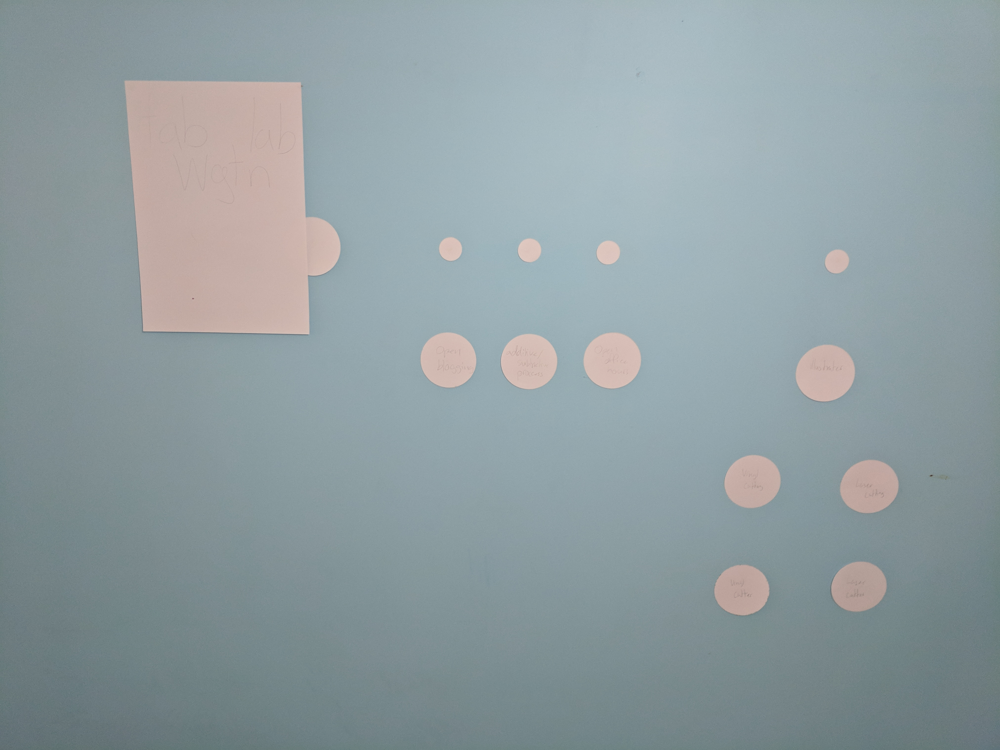
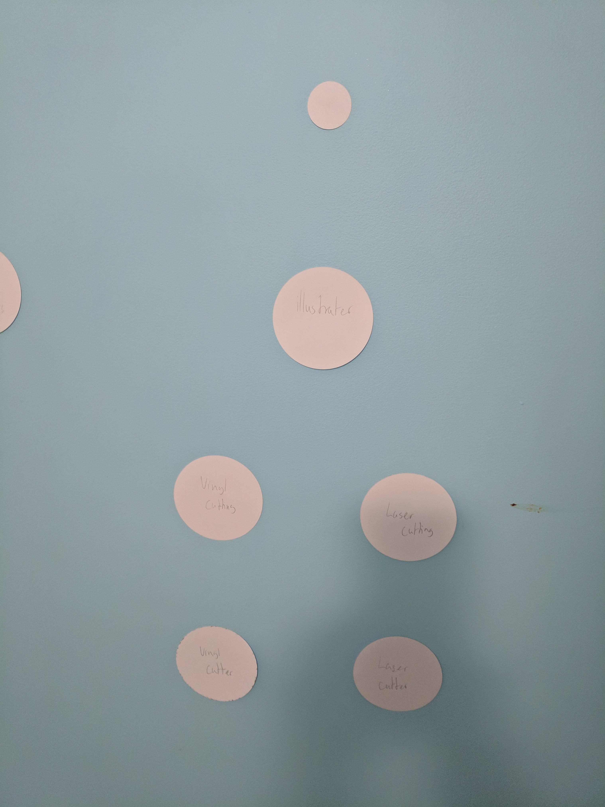

Above is some images of the paper prototyping we did.
Both Liz and I quite like the layout shown in the photo as it can be nicely divided into different sections.

### Button Style

Trying out different button styles.
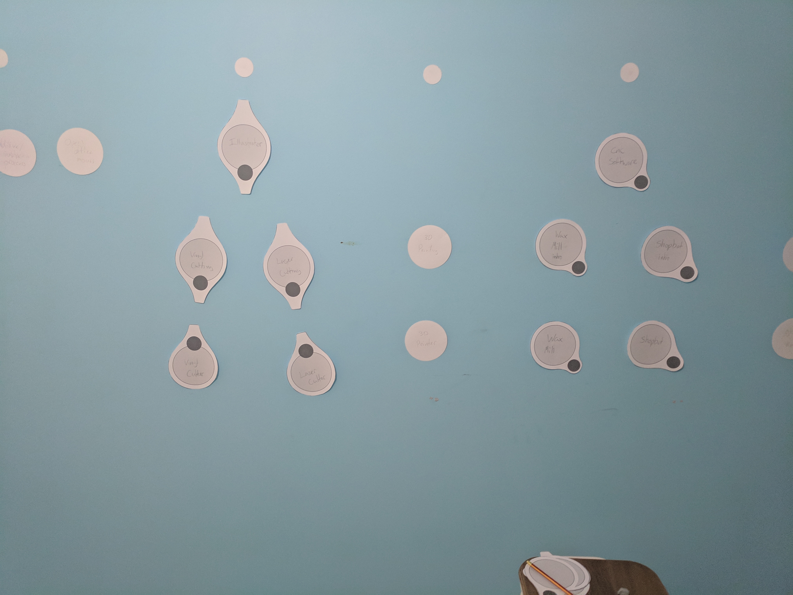

The small dark circles are the pushable buttons.
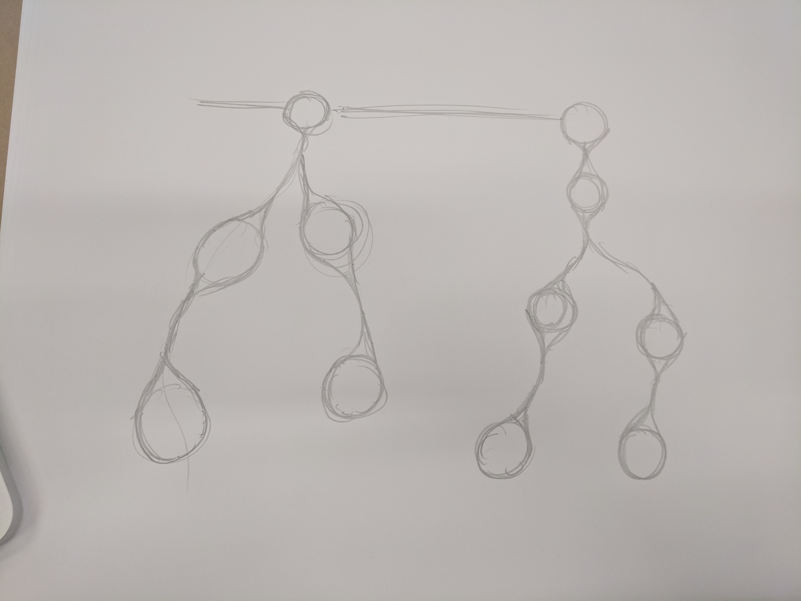
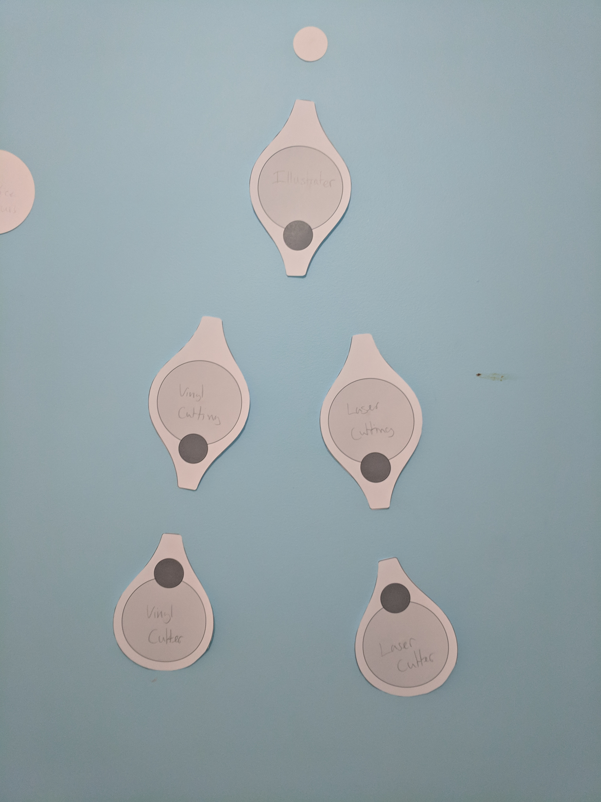
A more interesting layout, much less grid like.

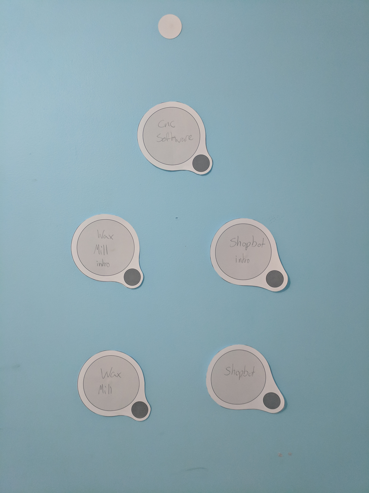
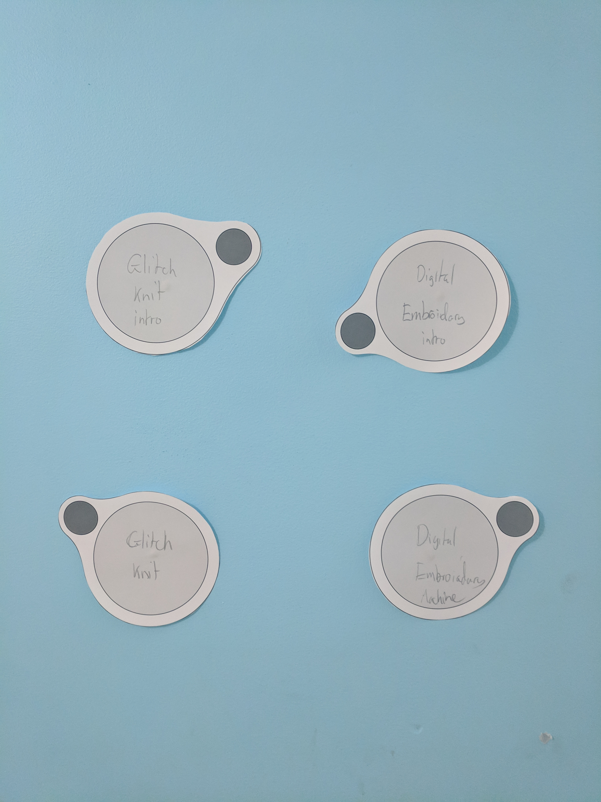

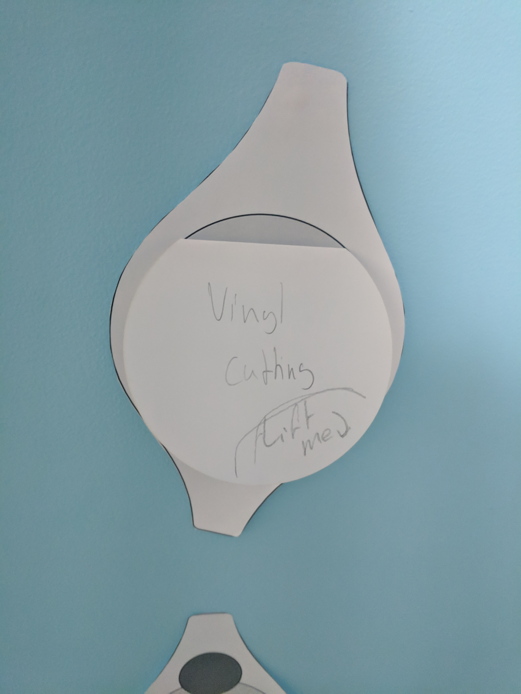
To add more information I could add a flap system.

## Electronics
To allow for modularity the wall is designed into sections each stemming off a node. Each node will contain a micro-controller and communicate with the base node.

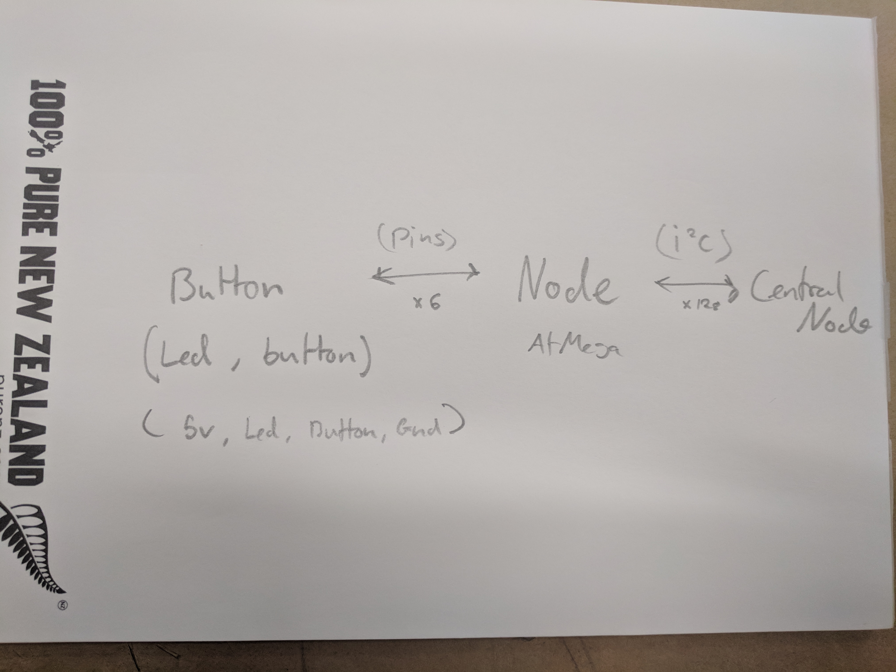
### Proof of Concept
For a proof of concept, I used 3 Arduino Unos and wrote some [code (basic i2c)](https://github.com/harryiliffe/interactive-wall/tree/master/code/testing/basic%20i2c).
The Arduinos communicate through i2c which allows for 2 way communication for the LEDs and buttons.
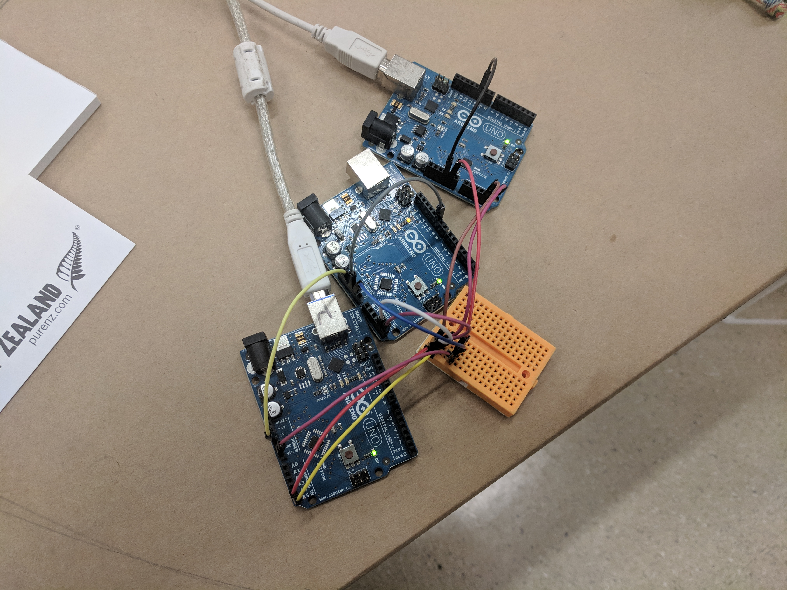
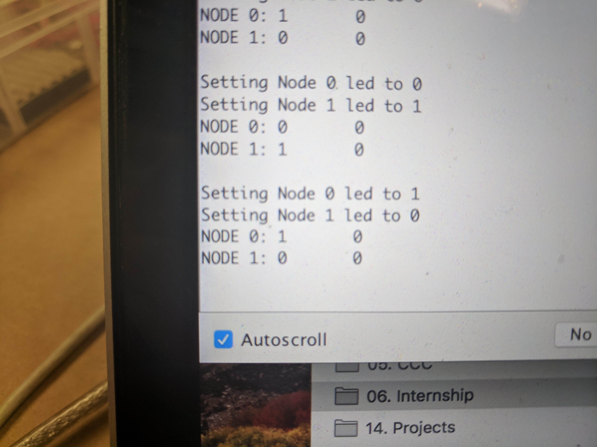

The proof of concept worked really well and with a little bit more work I will be able to create an easy to read library for communicating between the Central Node and the Nodes.
